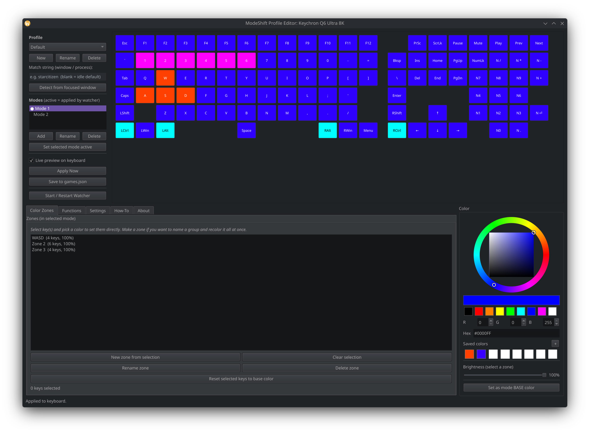
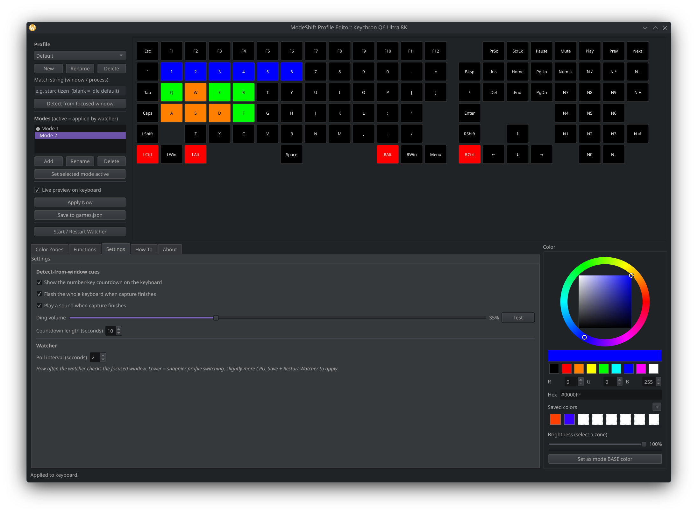
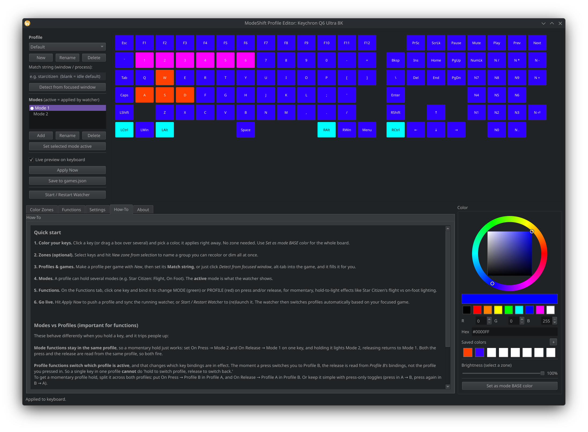

# ModeShift

**RGB lighting profiles for OpenRGB keyboards on Linux.**

https://github.com/user-attachments/assets/d59fe3e0-d4f1-4e25-af7e-bf12bf77eff5

ModeShift gives your OpenRGB-controllable keyboard per-key lighting profiles that
switch automatically when you change games, plus modes you can flip through and
hold-to-switch key bindings. Think of it as an OpenRGB-style lighting profile
manager focused on gaming, built for Linux desktops (developed on KDE Plasma
Wayland).

It is not a replacement for OpenRGB. OpenRGB does the hardware talking; ModeShift
sits on top of it and manages the lighting logic (profiles, modes, zones,
per-game switching).


## Features

- **Per-key lighting** on a live picture of your actual keyboard, drawn from
  OpenRGB's own layout data (so it works on many OpenRGB keyboards, not just one).
- **Profiles** tied to games. The watcher detects the focused window and applies
  the matching profile automatically.
- **Modes** within a profile (for example Flight, On Foot, Mining) that you can
  switch between.
- **Zones** (named key groups with a color and brightness) over a base color, or
  color individual keys directly with no zone required.
- **Functions**: bind a physical key to change mode or profile on press and/or
  release, including momentary hold-to-switch lighting.
- **HSV color wheel** with a brightness slider and up to 64 saved custom colors.
- **Detect from focused window**: a countdown then auto-fills a game's match
  string from whatever window is focused, with an optional sound and a keyboard
  flash finale.
- **System tray daemon** with pause, manual profile override, and reload.
- **Settings** for the ding, ding volume, countdown lights, countdown length, and
  watcher poll interval.

## Screenshots

### Color Zones
Per-key lighting painted on a live map of your actual keyboard.



### Functions
Bind a key to change mode or profile on press and release.


### Settings
Toggle the ding, countdown lights, ding volume, countdown length, and watcher poll interval.



### How-To
The built-in guide, including the modes vs profiles explanation.



## How it works

ModeShift is two programs sharing one config file (`games.json`):

- `modeshift_editor.py` is the GUI. You edit profiles, modes, zones, and per-key
  colors, and bind functions.
- `modeshift_watcher.py` is the background tray daemon. It watches the focused
  window and applies the right profile, or whatever you pick from the tray. This
  is what actually lights the keyboard.

`modeshift_common.py` holds the shared logic. `diagnose_zones.py` is a one-off helper
that dumps your keyboard's zone/matrix data.

## Requirements

- **OpenRGB** with the SDK Server running (OpenRGB, SDK Server tab, Start Server).
- **Python 3.9+**.
- The Python packages in `requirements.txt`.
- For automatic game detection on **KDE Plasma Wayland**: `kdotool`.
- For **hold-to-switch key functions**: your user in the `input` group.

## Install

Clone the repo, then install the Python dependencies:

```bash
git clone https://github.com/storymode-exe/modeshift.git
cd modeshift
pip install -r requirements.txt
```

If your distro manages Python packages externally (Arch and derivatives), either
use a virtual environment or add `--break-system-packages` to the pip command.

System packages by distro:

**Arch / CachyOS / Manjaro**

```bash
sudo pacman -S openrgb python-pyside6
paru -S kdotool   # or yay; kdotool is in the AUR, for KDE Wayland window detection
```

**Debian / Ubuntu / Pop!_OS**

```bash
sudo apt install openrgb python3-pyside6.qtwidgets python3-evdev
# kdotool: build from source or grab a release (needed only on KDE Wayland)
```

**Fedora**

```bash
sudo dnf install openrgb python3-pyside6
# kdotool: build from source or grab a release (needed only on KDE Wayland)
```

### Key functions setup (all distros)

This step is **not** distro-specific. Everyone who wants the hold-to-switch key functions (change mode or profile on a keypress) must do it, no matter the distro. The watcher reads raw keyboard input, which requires your user to be in the `input` group:

```bash
sudo usermod -aG input $USER      # then log out and back in
```

First run: copy the example config so ModeShift has something to start from.

```bash
cp games.example.json games.json
```

## Usage

Edit lighting:

```bash
python3 modeshift_editor.py
```

Run the daemon:

```bash
python3 modeshift_watcher.py
```

A tray icon appears. Right-click to pause, choose Auto (detect game), force a
specific profile, reload after editing, or quit.

List your keyboard's exact key names:

```bash
python3 modeshift_watcher.py --list-leds
```

Install the app-menu entries and log-in autostart (rewrites the paths to wherever
you cloned the repo):

```bash
./install_desktop.sh
```

## Linux desktop support

Everything except automatic game detection is desktop-agnostic: the editor,
manual profile switching from the tray, modes, zones, and key functions all work
regardless of your compositor.

Automatic "focused window" detection currently uses `kdotool`, which targets
**KDE Plasma on Wayland**. X11 desktops and other Wayland compositors are on the
roadmap (the plan is to add `xdotool`/`wmctrl` for X11 and a compositor-neutral
path where possible). Until then, on other desktops you can still drive everything
manually from the tray.

## Configuration

ModeShift stores its data next to the scripts:

- `games.json` is your profiles, modes, zones, and functions (per device).
- `custom_colors.json` is your saved swatches.
- `settings.json` is the editor/watcher settings.
- `watcher_command.json` is a small file the editor uses to nudge the running
  watcher.

All four are per-user and are git-ignored, so your setup never gets committed.

## Credits

Huge thanks to **naaraxi** for the Keychron OpenRGB plugin and the firmware work
behind it. Without it my keyboard would not communicate with OpenRGB at all, and
ModeShift would never have crossed my mind to build.
https://github.com/naaraxi/keychron_ultra_openrgb

Built on top of the excellent [OpenRGB](https://openrgb.org/) project.

## License

ModeShift is free software under the **GNU General Public License v3.0**. See
[LICENSE](LICENSE) for the full text.

## Support

If ModeShift saved you from wrestling with configs, a coffee is appreciated but
never required: https://ko-fi.com/storymode
