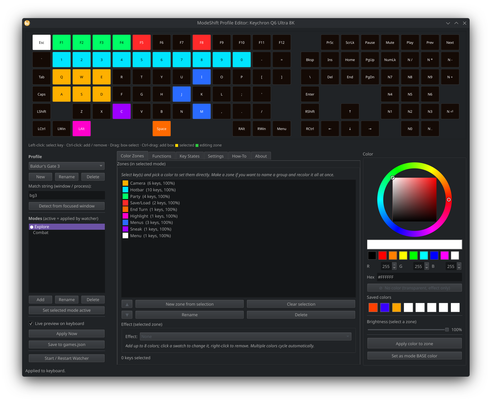
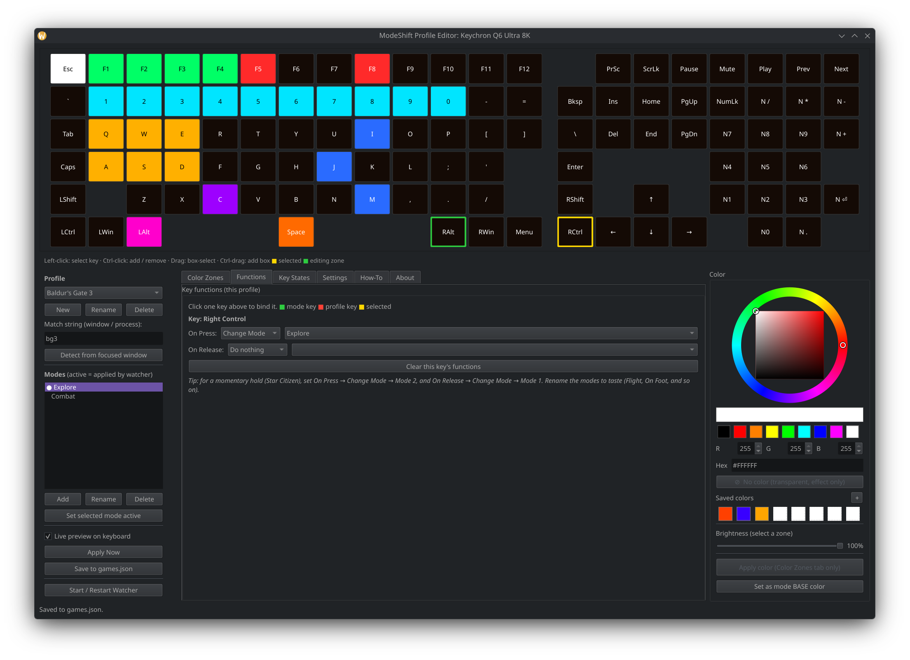
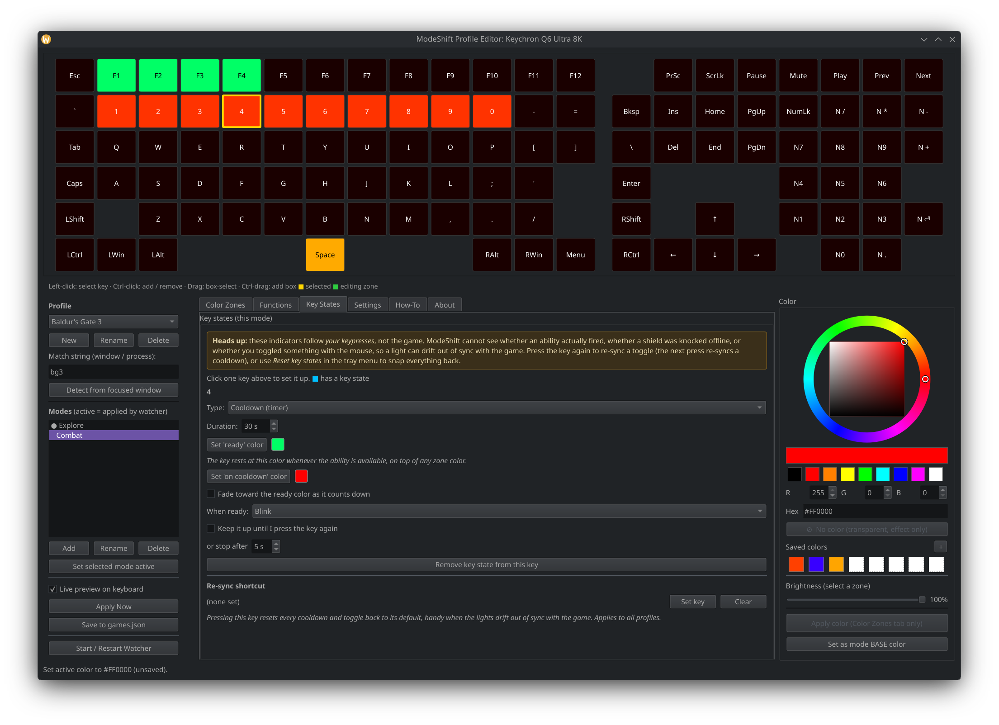
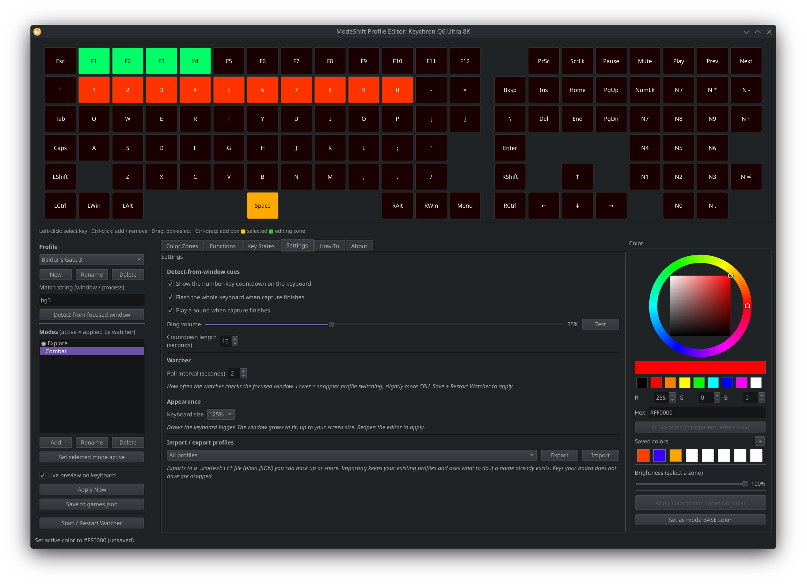

# ModeShift

**RGB lighting profiles for OpenRGB keyboards on Linux.**

ModeShift gives your OpenRGB-controllable keyboard per-key lighting profiles that
switch automatically when you change games, plus animated effects, modes you can
flip between, and per-key indicators for cooldowns and toggles. Think of it as an
OpenRGB-style lighting profile manager focused on gaming, built for Linux desktops
(developed on KDE Plasma Wayland).

It is not a replacement for OpenRGB. OpenRGB does the hardware talking; ModeShift
sits on top of it and manages the lighting logic.

<!-- Drag your demo video in here on github.com to embed it above the screenshots -->

## Screenshots

### Color Zones
Per-key lighting painted on a live map of your actual keyboard. Zones are layers
you can reorder, and each one can carry its own effect and colors.



### Functions
Bind a key to change mode or profile on press and release, for momentary
hold-to-light setups.



### Key States
Give a key a cooldown timer or an on/off toggle, so it doubles as a status light
for the game you are playing.



### Settings
Detection cues, watcher poll interval, keyboard size, and profile import/export.



## Features

- **Per-key lighting** on a live map of your actual keyboard, drawn from OpenRGB's
  own layout data, so it works on many OpenRGB keyboards, not just one.
- **Profiles per game**, applied automatically by a tray watcher that follows your
  focused window.
- **Modes** inside a profile (for example Flight, On Foot, Mining) with
  hold-a-key-to-switch bindings.
- **Zones as layers**: named key groups you can reorder, with the top of the list
  winning where zones overlap. Zones can also be transparent, carrying only an
  effect.
- **Per-zone effects**: type lighting (keys light up as you type), breathing,
  blinking, color cycle (rainbow or your own colors), and twinkle. Each effect
  takes up to 8 colors and cycles through them.
- **Key States**: give a key a **cooldown** (press starts a timer, the key fades
  from the cooldown color toward the ready color, then signals ready) or a
  **toggle** (press flips it between colors and it stays there). Handy for ability
  cooldowns and for shields or engines on/off.
- **HSV color picker** with a brightness slider and up to 64 saved custom colors.
- **Detect from focused window** to fill in a game's match string for you, with a
  keyboard countdown and an optional sound.
- **Import and export profiles** as portable `.modeshift` files, so you can back
  them up or share them.

https://github.com/user-attachments/assets/0c7e1408-f6f9-44cd-9a2d-71e11c5da39a

## How it works

ModeShift is two programs sharing one config file (`games.json`):

- `modeshift_editor.py` is the GUI. You edit profiles, modes, zones, effects, key
  functions, and key states.
- `modeshift_watcher.py` is the background tray daemon. It watches the focused
  window, applies the right profile, runs the effects, and reads your keypresses
  for type lighting and key states. This is what actually lights the keyboard.

`modeshift_common.py` holds the shared logic and `modeshift_effects.py` the
effects engine. `diagnose_zones.py` is a one-off helper that dumps your keyboard's
zone and matrix data.

## Requirements

- **OpenRGB** with the SDK Server running (OpenRGB, SDK Server tab, Start Server).
- **Python 3.9+**.
- The Python packages in `requirements.txt`.
- For automatic game detection on **KDE Plasma Wayland**: `kdotool`.
- For **key functions, type lighting, and key states**: your user in the `input`
  group.

## Install

Clone the repo, then install the Python dependencies:

```bash
git clone https://github.com/storymode-exe/ModeShift.git
cd ModeShift
pip install -r requirements.txt
```

If your distro manages Python packages externally (Arch and derivatives), either
use a virtual environment or add `--break-system-packages` to the pip command.

System packages by distro:

**Arch / CachyOS / Manjaro**

```bash
sudo pacman -S openrgb python-pyside6
paru -S kdotool   # or yay; kdotool is in the AUR, for KDE Wayland window detection
```

**Debian / Ubuntu / Pop!_OS**

```bash
sudo apt install openrgb python3-pyside6.qtwidgets python3-evdev
# kdotool: build from source or grab a release (needed only on KDE Wayland)
```

**Fedora**

```bash
sudo dnf install openrgb python3-pyside6
# kdotool: build from source or grab a release (needed only on KDE Wayland)
```

### Key input setup (all distros)

This step is **not** distro-specific. Everyone who wants hold-to-switch key
functions, type lighting, or key states must do it, no matter the distro. The
watcher reads raw keyboard input, which requires your user to be in the `input`
group:

```bash
sudo usermod -aG input $USER      # then log out and back in
```

First run: copy the example config so ModeShift has something to start from.

```bash
cp games.example.json games.json
```

## Usage

Edit lighting:

```bash
python3 modeshift_editor.py
```

Run the daemon:

```bash
python3 modeshift_watcher.py
```

A tray icon appears. Right-click to pause, choose Auto (detect game), force a
specific profile, reset key states, reload after editing, or quit.

List your keyboard's exact key names:

```bash
python3 modeshift_watcher.py --list-leds
```

Install the app-menu entries and log-in autostart (rewrites the paths to wherever
you cloned the repo):

```bash
./install_desktop.sh
```

## How the layers work

Everything is drawn bottom up:

1. the mode's **base color**
2. **zones** (the top zone in the list wins where they overlap)
3. **direct key colors** set on individual keys
4. **zone effects**
5. **Key State colors** (cooldown and toggle)

So a Key State color always covers whatever that key was set to in Color Zones.
That is deliberate: an ability's status should always be readable.

## Linux desktop support

Everything except automatic game detection is desktop-agnostic: the editor, manual
profile switching from the tray, modes, zones, effects, key functions, and key
states all work regardless of your compositor.

Automatic "focused window" detection currently uses `kdotool`, which targets **KDE
Plasma on Wayland**. X11 desktops and other Wayland compositors are on the roadmap.
Until then, on other desktops you can still drive everything manually from the tray.

## Configuration

ModeShift stores its data next to the scripts:

- `games.json` is your profiles, modes, zones, effects, functions, and key states.
- `custom_colors.json` is your saved swatches.
- `settings.json` is the editor and watcher settings.
- `watcher_command.json` is a small file the editor uses to nudge the running watcher.

All four are per-user and git-ignored, so your setup never gets committed. Use
**Settings, Import / export profiles** to back up or share individual profiles.

## A note on key states

Cooldowns and toggles follow **your keypresses**, not the game. ModeShift cannot
see whether an ability actually fired, whether a shield was knocked offline, or
whether you toggled something with the mouse, so an indicator can drift out of
sync. Press the key again to re-sync a toggle, or set a re-sync shortcut (a key or
a combo) on the Key States tab.

## Credits

Huge thanks to **naaraxi** for the Keychron OpenRGB plugin and the firmware work
behind it. Without him my keyboard would not communicate with OpenRGB at all, and
ModeShift would never have crossed my mind to build.
https://github.com/naaraxi/keychron_ultra_openrgb

Built on top of the excellent [OpenRGB](https://openrgb.org/) project.

## License

ModeShift is free software under the **GNU General Public License v3.0**. See
[LICENSE](LICENSE) for the full text.

## Support

If ModeShift saved you from wrestling with configs, a coffee is appreciated but
never required: https://ko-fi.com/storymode
